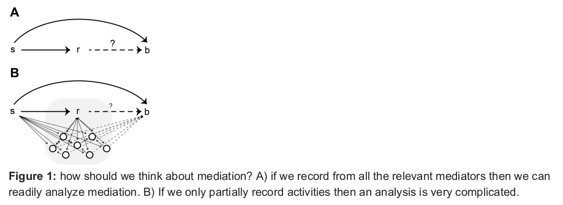
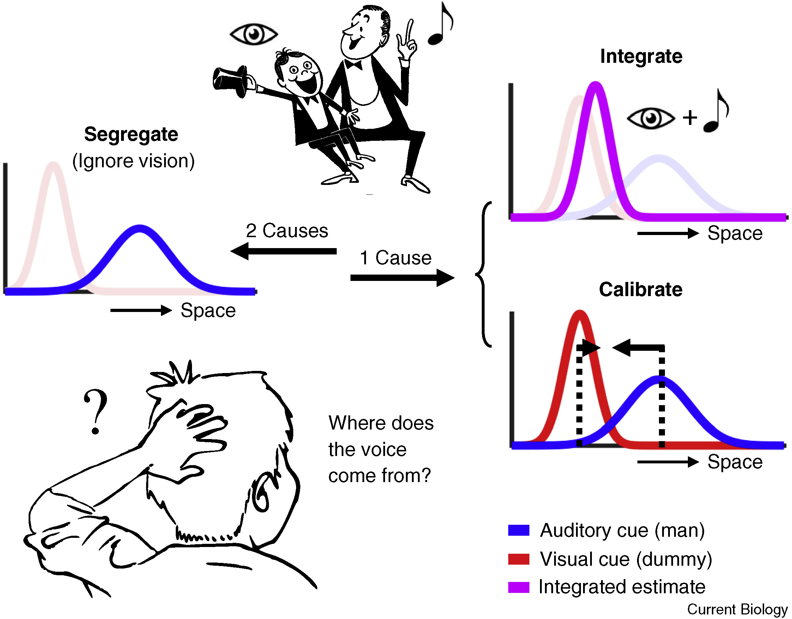
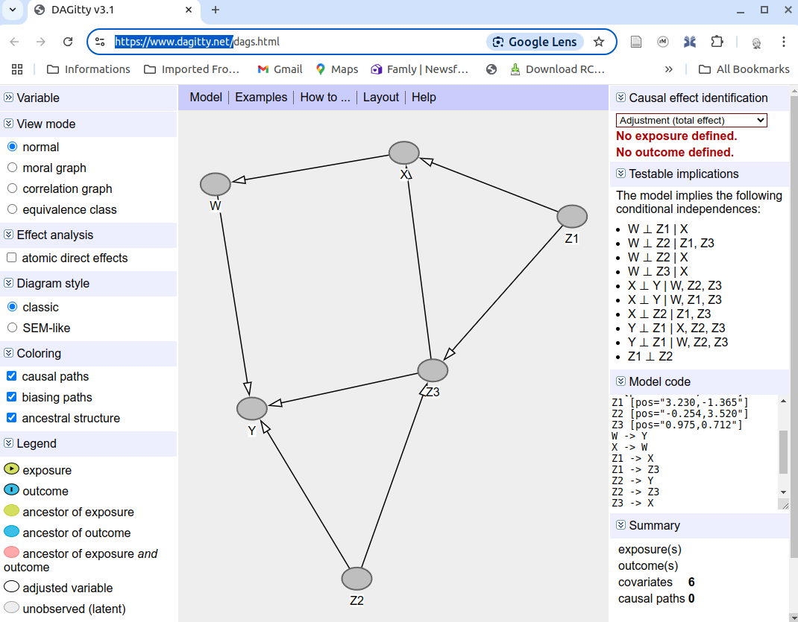
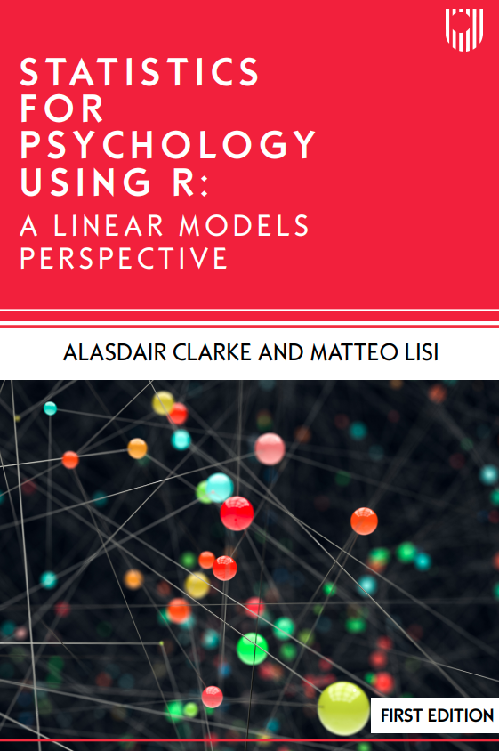

```{r, echo=FALSE, message=FALSE, warning=FALSE}
library(tidyverse)
library(ggdag)
library(dagitty)
```

<!-- ## Outline -->

<!-- ::: nonincremental -->
<!-- 1.  DAGs (Directed Acyclic Graphs) -->

<!-- 2.  Testable implications of DAGs -->

<!-- 3.  Estimating causal effects -->

<!-- 4.  Final thoughts & 'Draw your DAG' exercise -->
<!-- ::: -->


## *Correlation does not imply causation*

```{r, echo=FALSE}
#| fig-cap: "Civil engineering doctorates awarded (in the US; source NSF)	as a function of the per capita consumption of mozzarella cheese, measured from 2000 to 2009."
#| fig-align: 'center'
#| fig-cap-location: margin
#| fig-width: 5
#| fig-height: 5

par(mar=c(5,4,1.5,1)+0.1)

year <- c(2000,	2001,	2002,	2003,	2004,	2005,	2006,	2007,	2008,	2009)
mozza <- c(9.3,	9.7,	9.7,	9.7,	9.9,	10.2,	10.5,	11,	10.6,	10.6)
engPhd <- c(480,	501,	540,	552,	547,	622,	655,	701,	712,	708)
d <- data.frame(year, mozza, engPhd)
d$mozza_kg <- d$mozza * 0.453592

m0 <- lm(engPhd~mozza_kg,d)
## summary(m0)
beta <- round(unname(coef(m0)),digits=2)

corr_cheese <- cor.test(d$engPhd,d$mozza_kg)

newx = seq(3,6,by = 0.1)
conf_interval <- predict(m0, newdata=data.frame(mozza_kg=newx), interval="confidence",level = 0.975)

par(pty="s")
plot(d$mozza_kg, d$engPhd,cex=1.5,pch=21,lwd=2,col="blue", xlab="Per-capita consumption of mozzarella cheese [Kg/year]",ylab="Civil engineering PhD awarded [N/year]",xlim=c(8.9,11.2)* 0.453592,ylim=c(440,760))
abline(m0,lwd=3)
lines(newx, conf_interval[,2], lty=2)
lines(newx, conf_interval[,3], lty=2)
text(4.7,450,bquote(italic(r)~"="~.(round(corr_cheese$estimate,digits=2))~"  "~italic(p)~"<.0001"))
```

## Causality

::: nonincremental
-   Taboo against explicit causal language in observational studies.
-   However, most research questions are 'causal'.
-   Papers tend include vague or implicit hints at causality, with disclaimers.
-   Readers (especially non-specialists) often misled into causal conclusions when these are not warranted.
-   **There is need for a principled framework for thinking clearly about causality.**
:::

<!-- ## Causality in neroscience -->

<!-- **Characterising the role of neurons for behavior is a causal inference question.** -->

<!-- {.nostretch fig-align="center" width="70%"} -->

<!-- -   Neural activity in LIP area was widely believed to causally mediate evidence accumulation in perceptual decision, until it was found it's pharmacological inactivation had no effect on behavioural performance ([Katz et al, Nature 2016](https://doi.org/10.1038/nature18617)) -->

<!-- ## Causal inference in human perception -->

<!-- **Our sensory system routinely make inferences about causes of the sensory signals it receives.** -->

<!-- {.nostretch fig-align="center" width="60%"} -->


<!-- ## *Common cause principle* -->

<!-- ::: nonincremental -->
<!-- There is no causation without correlation (Reichenbach, 1956) -->

<!--   -->

<!-- > If $X$ and $Y$ are statistically dependent ($X \not\!\perp\!\!\!\perp  Y$)[^1],\ -->
<!-- > then either: -->
<!-- > -->
<!-- > 1.  $X$ causes $Y$; -->
<!-- > 2.  $Y$ causes $X$; -->
<!-- > 3.  a third variable $Z$ causes *both* $X$ and $Y$ -->

<!-- <!-- (in which case $X \perp\!\!\!\perp  Y \mid Z$). -->
<!-- ::: -->

<!-- [^1]: The symbol $\not\!\perp\!\!\!\perp$ means *"not independent of"*. Conversely $A \!\perp\!\!\!\perp  B$ means "$A$ and $B$ are independent". -->

## 

```{r}
#| fig-height: 4
#| fig-width: 6
#| fig-align: center
#| echo: FALSE

coord_dag <- list(x = c(phds = 1, mozza = -1, third = 0)*1.5,
                  y = c(phds = -1, mozza = -1, third = 1))

dag <- dagify(mozza ~ third,
               phds ~ third,
               labels = c(
                 mozza = "mozzarella\nconsumption",
                 third = "third\nvariable(s)",
                 phds = "PhDs awarded"),
               coords = coord_dag)

# adjustmentSets( dag , exposure="mozza" , outcome="phds" )

dag %>% 
  tidy_dagitty(layout = "nicely") %>% 
  ggplot(aes(x = x, y = y, xend = xend, yend = yend))+
  geom_dag_point(colour = 'white', size = 40) +
  geom_dag_text(aes(label=label), colour = 'black',family="Corbel") +
  geom_dag_edges(start_cap = ggraph::circle(12, 'mm'),
                 end_cap = ggraph::circle(12, 'mm')) +
  theme_dag() +
  coord_equal(xlim=c(-2,2),
              ylim=c(-1,1))

```

## Directed Acyclic Graphs (DAGs)

 

::::: columns
::: {.column width="50%"}

:::: nonincremental

-   A collection of **nodes** and **edges**

-   Edges are *directed* arrows and indicates causal links.

-   A **path** is the set of nodes connecting any two nodes.

::::

-   The node that a directed edge starts from is called the *parent* of the node that the edge goes into (*child* node).

-   More than 1 node separation: *ancestor* and *descendant* nodes.

-   *Exogenous variables* $\{ X \}$ external variables not caused by the model.

-   *Endogenous variables* $\{ Y, W, Z\}$ variables determined by other variables in the model.


:::

::: {.column width="50%"}
```{r}
#| fig-height: 5
#| fig-width: 2.5
#| fig-align: center
#| echo: FALSE

dag <- dagify(
  Z ~ W + Y,
  Y ~ X + W,
  W ~X,
  coords = list(
    x = c( X = 0, Y = 0, W=1, Z=0),
    y = c( X = 1, Y = 0, W=0, Z=-1)
  )
)

# adjustmentSets( dag , exposure="W" , outcome="Z" )

ggdag(dag, node=FALSE, text_col = "black", text_size = 8) + 
  #geom_dag_point(colour = 'white', size = 40) +
  # geom_dag_text(colour = 'black',family="Corbel") +
  # geom_dag_edges(start_cap = ggraph::circle(4, 'mm'),
  #                end_cap = ggraph::circle(4, 'mm')) +
  theme_dag()
```
:::
:::::

## "Graphical" definitions of causality

::::: columns
::: {.column width="50%"}
-   A parent variable is a **direct cause** of it's child variables\
    ($X$ is a direct cause of $Y$).

-   An ancestor variable is an **indirect or potential cause** of its descendants\
    ($X$ is a potential cause of $Z$).
:::

::: {.column width="50%"}
```{r}
#| fig-height: 5
#| fig-width: 2.5
#| fig-align: center
#| echo: FALSE

dag <- dagify(
  Z ~ W + Y,
  Y ~ X + W,
  W ~X,
  coords = list(
    x = c( X = 0, Y = 0, W=1, Z=0),
    y = c( X = 1, Y = 0, W=0, Z=-1)
  )
)

# adjustmentSets( dag , exposure="W" , outcome="Z" )

ggdag(dag, node=FALSE, text_col = "black", text_size = 8) + 
  #geom_dag_point(colour = 'white', size = 40) +
  # geom_dag_text(colour = 'black',family="Corbel") +
  # geom_dag_edges(start_cap = ggraph::circle(4, 'mm'),
  #                end_cap = ggraph::circle(4, 'mm')) +
  theme_dag()
```
:::
:::::

## Acyclicity in DAGs {.nostretch}

::: nonincremental
-   Acyclicity may seem problematic in presence of **feedback loops**.

-   One way to deal with these is by adding nodes for repeated observations of the same variable
:::

```{r}
#| fig-height: 2.5
#| fig-width: 5
#| fig-align: center
#| echo: false

dag <- dagify(
  X2 ~ X1 + Y1,
  Y2 ~ X1 + Y1,
  X3 ~ X2 + Y2,
  Y3 ~ X2 + Y2,
  coords = list(
    x = c(X1 = -1, X2 = 0, X3=1, Y1=-1, Y2=0, Y3=1),
    y = c(X1 = -0.5, X2 = -0.5, X3=-0.5, Y1=0.5, Y2=0.5, Y3=0.5)
  )
)


dag <- dag %>%
  tidy_dagitty() %>%
  arrange(name) %>%
  mutate(
    label = c("X[1]","X[1]", "X[2]",  "X[2]", "X[3]", "Y[1]","Y[1]", "Y[2]","Y[2]", "Y[3]")  # plotmath as strings
  )

dag %>%
  arrange(name) %>%
  ggplot(aes(x = x, y = y, xend = xend, yend = yend)) +
  geom_dag_edges() +
  geom_dag_text(
    aes(label = label),
    parse = TRUE,
    col = "black",
    size=8
  ) +
  theme_dag()

```

## "Structural" errors

:::::: columns
:::: {.column width="35%"}
 

Each variable in a DAG is usually assumed to be observed with some "error" ($\epsilon_W, \epsilon_X, \ldots$).

 

These errors are assumed to be *independent* from each other, and are usually not shown for simplicity

 

::: fragment
*"The disturbance terms represent independent background factors that the investigator chooses not to include in the analysis"* (Pearl, 2009)
:::
::::

::: {.column width="65%"}
```{r}
#| fig-height: 6
#| fig-width: 4.7
#| fig-align: center
#| echo: FALSE

dag <- dagify(
  Z ~ W + Y,
  Y ~ X + W,
  W ~X,
  Z ~ eZ,
  Y ~ eY,
  X ~ eX,
  W ~ eW,
  coords = list(
    x = c( X = 0, Y = 0, W=1, Z=0, eX = 0+0.5, eY = 0-0.5, eW=1+0.5, eZ=0-0.5),
    y = c( X = 1, Y = 0, W=0, Z=-1, eX = 1+0.5, eY = 0+0.5, eW=0+0.5, eZ=-1+0.5)
  )
)

dag %>%
  tidy_dagitty() %>%
  arrange(name) %>%
  mutate(
    label = case_when(
      name == "X"  ~ "bold(X)",
      name == "W"  ~ "bold(W)",
      name == "Y"  ~ "bold(Y)",
      name == "Z"  ~ "bold(Z)",
      name == "eX" ~ "epsilon[X]",
      name == "eW" ~ "epsilon[W]",
      name == "eY" ~ "epsilon[Y]",
      name == "eZ" ~ "epsilon[Z]"
    )
  ) %>%
  ggplot(aes(x = x, y = y, xend = xend, yend = yend)) +
  geom_dag_edges() +
  geom_dag_text(
    aes(label = label),
    parse = TRUE,
    col = "black",
    size = 8
  ) +
  theme_dag()

# adjustmentSets( dag , exposure="W" , outcome="Z" )

# ggdag(dag, node=FALSE, text_col = "black", text_size = 8) +
#   #geom_dag_point(colour = 'white', size = 40) +
#   # geom_dag_text(colour = 'black',family="Corbel") +
#   # geom_dag_edges(start_cap = ggraph::circle(4, 'mm'),
#   #                end_cap = ggraph::circle(4, 'mm')) +
#   theme_dag()
```
:::
::::::

## Product decomposition in DAGs

::::::::: columns
::::::: {.column width="50%"}
::: fragment}
We can write the **joint distribution** of all variables in a DAG as the product of the conditional distributions $p(\text{child} \mid \text{parents})$
:::

 

::: fragment
\begin{align*}p & (X, Y,W,Z) =\\ & p(Z∣W,Y) \, p(Y∣X,W) \, p(W∣X) \, p(X) \end{align*}
:::

::: fragment
This holds regardless of the specific functional form associated with each arrow.
:::

 

::: {.fragment .fade-up}
[**A DAG provides a *blueprint* defining a family of joint probability distributions over a set of variables.**]{style="color:red;"}
:::
:::::::

::: {.column width="50%"}
```{r}
#| fig-height: 5
#| fig-width: 2.5
#| fig-align: center
#| echo: FALSE

dag <- dagify(
  Z ~ W + Y,
  Y ~ X + W,
  W ~X,
  coords = list(
    x = c( X = 0, Y = 0, W=1, Z=0),
    y = c( X = 1, Y = 0, W=0, Z=-1)
  )
)

# adjustmentSets( dag , exposure="W" , outcome="Z" )

ggdag(dag, node=FALSE, text_col = "black", text_size = 8) + 
  theme_dag()
```
:::
:::::::::

## Conditional and unconditional independencies

The structure of a DAG imposes constraints on the possible joint distribution of its variables, and these constraints can be tested empirically.

- **Unconditional (in)dependencies**: which variables should be associated, or not associated, with one another.

- **Conditional (in)dependencies**: which variables should become associated or independent after we *condition* on another variable, or set of variables.


## What does *"conditioning on a variable"* means?

::::::::::: {style="font-size: 80%;"}
::: fragment
*Conditioning* on a variable here can be understood as *controlling for* it.
:::

 


::: fragment
Conditioning on $Z$ when studying the link between $X$ and $Y$ means introducing information about $Z$ in our analysis, and asking whether $X$ provides any additional information about $Y$, above and beyond what is already known from $Z$.
:::

:::::: fragment
::::: columns
::: {.column width="50%"}
 

$$Y \perp\!\!\!\perp  X \mid Z$$
:::

::: {.column width="50%"}
```{r}
#| fig-height: 2
#| fig-width: 3  # Half the slider width when default slide width is 4
#| fig-align: center
#| echo: FALSE
#| 
coord_dag <- list(x = c(X = -1, Y = 1, Z = 0)*1.5,
                  y = c(X = -1, Y = -1, Z = 1))

dag <- dagify(X ~ Z,
               Y ~ Z,
               coords = coord_dag)

ggdag(dag, node=FALSE, text_col = "black", text_size = 8) + 
  theme_dag()

```
:::
:::::
::::::

::: fragment
 

:::: nonincremental

How can we condition on, or control for, a variable in practice?

-   **Stratified analysis**

-   **Including it as a covariate in a regression model**

-   **Matching**

::::

:::

<!-- ::: fragment -->
<!-- All methods of statistical control are affected by measurement errors in confounding variables. -->
<!-- ::: -->

:::::::::::

## Confounding {.nostretch}

```{r}
#| echo: FALSE
#| fig-height: 4.5
#| fig-width: 6
#| fig-align: center

coord_dag <- list(x = c(X = -1, Y = 1, Z = 0)*1.5,
                  y = c(X = -1, Y = -1, Z = 1))

dag <- dagify(Y ~ X,
               labels = c(
                 X = "Height",
                 Y = "Salary",
                 Z = " "),
               coords = coord_dag)

dag %>% 
  tidy_dagitty(layout = "nicely") %>% 
  ggplot(aes(x = x, y = y, xend = xend, yend = yend))+
  geom_dag_point(colour = 'white', size = 40) +
  geom_dag_text(aes(label=label), colour = 'black',family="URWGothic", size=7) +
  geom_dag_edges(start_cap = ggraph::circle(12, 'mm'),
                 end_cap = ggraph::circle(12, 'mm')) +
  theme_dag() +
  coord_equal(xlim=c(-2,2),
              ylim=c(-1,1))
```

## Confounding {.nostretch}

```{r}
#| echo: FALSE
#| fig-height: 4.5
#| fig-width: 6
#| fig-align: center

coord_dag <- list(x = c(X = -1, Y = 1, Z = 0)*1.5,
                  y = c(X = -1, Y = -1, Z = 1))

dag <- dagify(X ~ Z,
               Y ~ Z,
               labels = c(
                 X = "Height",
                 Y = "Salary",
                 Z = "Sex"),
               coords = coord_dag)

dag %>% 
  tidy_dagitty(layout = "nicely") %>% 
  ggplot(aes(x = x, y = y, xend = xend, yend = yend))+
  geom_dag_point(colour = 'white', size = 40) +
  geom_dag_text(aes(label=label), colour = 'black',family="URWGothic", size=7) +
  geom_dag_edges(start_cap = ggraph::circle(12, 'mm'),
                 end_cap = ggraph::circle(12, 'mm')) +
  theme_dag() +
  coord_equal(xlim=c(-2,2),
              ylim=c(-1,1))
```

## Colliders {.nostretch}

 

```{r}
#| fig-height: 2
#| fig-width: 3  # Half the slider width when default slide width is 4
#| fig-align: center
#| echo: FALSE
#| 
coord_dag <- list(x = c(X = -1, Y = 1, C = 0)*1.5,
                  y = c(X = 1, Y = 1, C = -1))

dag <- dagify(C ~ X,
               C ~ Y,
               coords = coord_dag)

ggdag(dag, node=FALSE, text_col = "black", text_size = 8) + 
  theme_dag()

```

-   $X$ and $Y$ are independent of each other $X \perp\!\!\!\perp  Y$

-   $C$ is caused by both $X$ and $Y$

-   They become dependent after we condition on the collider node $C$;\
    ($A \not\!\perp\!\!\!\perp  B \mid C$)

## Cake competition example {.nostretch}

::::::::: columns
::::::: {.column width="65%"}

```{r}
#| echo: FALSE
#| fig-height: 2.5
#| fig-width: 4
#| fig-align: center

coord_dag <- list(x = c(t = 1, a = -1, cake_shortlist = 0)*1.5,
                  y = c(t = -1, a = -1, cake_shortlist = 1))

dag <- dagify(cake_shortlist ~ a,
               cake_shortlist ~ t,
               labels = c(
                 t = "Delicious",
                 a = "Attractive",
                 cake_shortlist = "Shortlisted (y/n)"),
               coords = coord_dag)

dag %>% 
  tidy_dagitty(layout = "nicely") %>% 
  ggplot(aes(x = x, y = y, xend = xend, yend = yend))+
  geom_dag_point(colour = 'white', size = 40) +
  geom_dag_text(aes(label=label), colour = 'black',family="URWGothic") +
  geom_dag_edges(start_cap = ggraph::circle(12, 'mm'),
                 end_cap = ggraph::circle(12, 'mm')) +
  theme_dag() +
  coord_equal(xlim=c(-2,2),
              ylim=c(-1,1))
```

:::::::

::::::: {.column width="35%"}

::: {.fragment fragment-index=1}

:::: {style="font-size: 70%;"}

-   No association between `appearance` and `taste` in the 'population' of cakes

 

-   `appearance` and `taste` becomes negatively correlated once we condition our analysis on whether a cake was shortlisted or not.

::::

:::

:::::::

::::::::: 


::: {.fragment fragment-index=1}

```{r}
#| echo: false
#| fig-height: 3
#| fig-align: center
#| fig-width: 8

set.seed(123)

n_cakes <- 300

t <- runif(n_cakes, 0, 10) # taste
a <- runif(n_cakes, 0, 10) # attractiveness
s <- t + a # overall score

cakes <- data.frame(id = 1:n_cakes,
                    t = t, a = a, s = s)
cake_shortlist <- subset(cakes, cakes$s >= 15)


par(mfrow=c(1,3))
plot(cakes$a, cakes$t, pch=3, col="black",xlab="taste",ylab="appearance")


cakes$col <- ifelse(cakes$s>=15, "blue", "red")
plot(cakes$a, cakes$t, pch=3, col=cakes$col,xlab="taste",ylab="appearance")
abline(a = 15, b = -1, lty = 3)

plot(cake_shortlist$a, cake_shortlist$t, pch=3, col="blue",xlab="taste",ylab="appearance", main="shortlisted cakes")

m <- lm(t~a, data = cake_shortlist)
a <- summary(m)$coefficient[1,1]
b <- summary(m)$coefficient[2,1]

abline(a = a, b = b, col="blue",lwd=1)
```
:::

<!-- ::: fragment -->

<!-- :::: {style="font-size: 70%;"} -->

<!-- -   No association between `appearance` and `taste` in the 'population' of cakes -->

<!-- -   `appearance` and `taste` becomes negatively correlated once we condition our analysis on whether a cake was shortlisted or not. -->

<!-- :::: -->

<!-- ::: -->

## Conditional independencies in complex DAGS   (D-separation) {.nostretch}

-   Realistic causal models are typically more complex and have more than 1 path between variables.

-   D-separation ("D" stands for *directional*) is when some variables on a directed graphs are independent of others

-   Assuming we are not conditioning on any variable, **two variables in a DAG are D-separated if all the paths between them contain a collider.**

-   Paths that do not contains colliders implies a correlation (dependency) between variables.

-   Some examples are "fork" paths $X \leftarrow Z \rightarrow Y$ or a "pipe" paths $X \rightarrow Z \rightarrow Y$. **These paths are said to be "open" and in order to "close" them (so as to D-separate** $X$ and $Y$ and make them independent) we need to condition on $Z$.

##  {.nostretch}

### D-separation: example

   

```{r}
#| fig-height: 3.5
#| fig-width: 6  # Half the slider width when default slide width is 4
#| fig-align: center
#| echo: FALSE
#| 

coord_dag <- list(x = c(X = 1, Y = 2.5, Z = -1, W=0, U=0)*1.5,
                  y = c(X = 0, Y = 0, Z = 0, W=-0.5, U=-1))

dag <- dagify(W ~ Z, 
              U ~ W,
              W ~ X,
              Y~X,
               coords = coord_dag)

ggdag(dag, node=FALSE, text_col = "black", text_size = 8) + 
  theme_dag()

# impliedConditionalIndependencies(dag)

```

::: fragment
$Z$ and $Y$ are D-separated (unconditionally independent, $Z \perp\!\!\!\perp  Y$)
:::

##  {.nostretch}

### D-separation: example

   

```{r}
#| fig-height: 3.5
#| fig-width: 6  # Half the slider width when default slide width is 4
#| fig-align: center
#| echo: FALSE
#| 

coord_dag <- list(x = c(X = 1, Y = 2.5, Z = -1, W=0, U=0)*1.5,
                  y = c(X = 0, Y = 0, Z = 0, W=-0.5, U=-1))

dag <- dagify(W ~ Z, 
              U ~ W,
              W ~ X,
              Y~X,
               coords = coord_dag)

# ggdag(dag, node=FALSE, text_col = "black", text_size = 8) + 
#   theme_dag()

# ggdag(dag, node = FALSE, text_col = "black", text_size = 8) + 
#   geom_dag_node(aes(color = ifelse(name == "W", "highlight", "default")), stroke = 5, shape = 1, size = 16) + 
#   scale_color_manual(values = c("highlight" = "black", "default" = rgb(1,1,1,0)), guide = "none") +
#   theme_dag()

ggdag(dag, node = FALSE, text_col = "black", text_size = 8) + 
  # Add a single circle for W explicitly
  geom_point(
    data = tidy_dagitty(dag) %>% filter(name == "W"),
    aes(x = x, y = y),
    shape = 1,  # Filled circle with one border
    size = 16,    # Adjust circle size
    color = "blue", # Black border
    stroke = 1.5     # Thickness of the border
  ) +
  theme_dag()

# impliedConditionalIndependencies(dag)

```

However, $W$ is a collider node, so if we condition our analysis on $W$ we would find a 'spurious' association between $Z$ and $Y$

 

<!-- (formally: $Z \not\!\perp\!\!\!\perp  Y \mid W$) -->

::: fragment
*This association is 'spurious' because* $Y$ is not a descendant of $Z$.\
(If we were to make an intervention on $Z$ this would have no effect on $Y$.)
:::

##  {.nostretch}

### D-separation: example

   

```{r}
#| fig-height: 3.5
#| fig-width: 6  # Half the slider width when default slide width is 4
#| fig-align: center
#| echo: FALSE
#| 

coord_dag <- list(x = c(X = 1, Y = 2.5, Z = -1, W=0, U=0)*1.5,
                  y = c(X = 0, Y = 0, Z = 0, W=-0.5, U=-1))

dag <- dagify(W ~ Z, 
              U ~ W,
              W ~ X,
              Y~X,
               coords = coord_dag)

# ggdag(dag, node=FALSE, text_col = "black", text_size = 8) +
#   theme_dag()

# ggdag(dag, node = FALSE, text_col = "black", text_size = 8) + 
#   geom_dag_node(aes(color = ifelse(name == "W", "highlight", "default")), stroke = 5, shape = 1, size = 16) + 
#   scale_color_manual(values = c("highlight" = "black", "default" = rgb(1,1,1,0)), guide = "none") +
#   theme_dag()

ggdag(dag, node = FALSE, text_col = "black", text_size = 8) + 
  # Add a single circle for W explicitly
  geom_point(
    data = tidy_dagitty(dag) %>% filter(name == "U"),
    aes(x = x, y = y),
    shape = 1,  # Filled circle with one border
    size = 16,    # Adjust circle size
    color = "blue", # Black border
    stroke = 1.5     # Thickness of the border
  ) +
  theme_dag()

# impliedConditionalIndependencies(dag)

```

**Conditioning on** $U$, the child of the collider node produces the same effect!

 

(formally $Z \not\!\perp\!\!\!\perp  Y \mid U$)

##  {.nostretch}

### D-separation: example 2

 

*Which variables that are D-separated (unconditionally independent) in this DAG?*

```{r}
#| fig-height: 4
#| fig-width: 6  # Half the slider width when default slide width is 4
#| fig-align: center
#| echo: FALSE
#| 

# Define the DAG
dag <- dagify(
  W ~ X,
  Y ~ W + Z3 + Z2,
  X ~ Z1 + Z3,
  Z3 ~ Z1 + Z2
)


dag %>%
  tidy_dagitty(seed = 12345) %>%
  arrange(name) %>%
  mutate(
    label = case_when(
      name == "W"  ~ "W",
      name == "X"  ~ "X",
      name == "Y"  ~ "Y",
      name == "Z1" ~ "Z[1]",
      name == "Z2" ~ "Z[2]",
      name == "Z3" ~ "Z[3]"
    )
  ) %>%
  ggplot(aes(x = x, y = y, xend = xend, yend = yend)) +
  geom_dag_edges() +
  geom_dag_text(
    aes(label = label),
    parse = TRUE,
    col = "black",
    size = 8
  ) +
  theme_dag()

```

::: fragment
Only $Z_1$ and $Z_2$ are unconditionally independent ( $Z_1 \perp\!\!\!\perp  Z_2$).
:::

##  {.nostretch}

### D-separation: example 2

 

*Conditional on which variables are* $Z_1$ and $W$ independent one another?

```{r}
#| fig-height: 4
#| fig-width: 6  # Half the slider width when default slide width is 4
#| fig-align: center
#| echo: FALSE
#| 

# Define the DAG
dag <- dagify(
  W ~ X,
  Y ~ W + Z3 + Z2,
  X ~ Z1 + Z3,
  Z3 ~ Z1 + Z2
)


dag %>%
  tidy_dagitty(seed = 12345) %>%
  arrange(name) %>%
  mutate(
    label = case_when(
      name == "W"  ~ "W",
      name == "X"  ~ "X",
      name == "Y"  ~ "Y",
      name == "Z1" ~ "Z[1]",
      name == "Z2" ~ "Z[2]",
      name == "Z3" ~ "Z[3]"
    )
  ) %>%
  ggplot(aes(x = x, y = y, xend = xend, yend = yend)) +
  geom_dag_edges() +
  geom_dag_text(
    aes(label = label),
    parse = TRUE,
    col = "black",
    size = 8
  ) +
  theme_dag()

```

::: fragment
Conditioning on $X$ makes $Z_1$ and $W$ independent one another ($W \perp\!\!\!\perp  Z_1 \mid X$); all other paths are "blocked" by a collider.
:::

## Automatic analysis of DAGs with [`dagitty`](https://www.dagitty.net/)



## Automatic analysis of DAGs with [`dagitty`](https://www.dagitty.net/)

`dagitty` is also available as an R package

```{r, echo=TRUE}
library(dagitty)

dag <- dagify(
  W ~ X,
  Y ~ W + Z3 + Z2,
  X ~ Z1 + Z3,
  Z3 ~ Z1 + Z2
)

impliedConditionalIndependencies(dag)
```

## Testable implications of DAGs

 

**We can use D-separation to falsify and test our DAG model!**

-   We have found that $W \perp\!\!\!\perp  Z_1 \mid X$\
    ($W$ is independent of $Z_1$ conditional on $X$)

-   This implies that if we regress $W$ on $X$ and $Z_1$, e.g. $$\widehat W = \beta_1 X + \beta_2 Z_1$$\
    we should find that $\beta_2 \approx 0$.

-   Finding that $\beta_2\ne 0$ would indicate that $W$ depends on $Z_1$ given $X$, implying that the DAG model is wrong.

-   More specifically, the DAG would be wrong because the 'true' model must have a path between $W$ and $Z_1$ that is not D-separated by $X$

##  {.nostretch}

### D-separation: example 1 again

   

```{r}
#| fig-height: 3.5
#| fig-width: 6  # Half the slider width when default slide width is 4
#| fig-align: center
#| echo: FALSE
#| 

coord_dag <- list(x = c(X = 1, Y = 2.5, Z = -1, W=0, U=0)*1.5,
                  y = c(X = 0, Y = 0, Z = 0, W=-0.5, U=-1))

dag <- dagify(W ~ Z, 
              U ~ W,
              W ~ X,
              Y~X,
               coords = coord_dag)


ggdag(dag, node = FALSE, text_col = "black", text_size = 8) + 
  # Add a single circle for W explicitly
  geom_point(
    data = tidy_dagitty(dag) %>% filter(name == "W" | name == "X"),
    aes(x = x, y = y),
    shape = 1,  # Filled circle with one border
    size = 16,    # Adjust circle size
    color = "blue", # Black border
    stroke = 1.5     # Thickness of the border
  ) +
  theme_dag()

# impliedConditionalIndependencies(dag)

```

What happens if we condition on *both* $W$ and $X$?

::: fragment
 

Conditioning on $\{ W,X \}$ makes $Z$ and $Y$ conditionally independent.

 

$Z \perp\!\!\!\perp  Y \mid \{ W,X \}$
:::

##  {.nostretch}

### D-separation

 

As complexity increases the answer is less and less intuitive.\
Luckily these questions can be addressed by mechanically applying logical rules, which have been automated in software like `dagitty`

:::::::: columns
::::: {.column width="55%"}
::: {.fragment fragment-index="1"}
```{r, echo=TRUE}
dag <- dagify(W ~ Z,
              U ~ W,
              W ~ X,
              Y ~ X)

# use dagitty to ask if Z and Y are 
# D-separated conditional on {W, X}
dseparated(dag, "Z", "Y", list("W", "X"))
```
:::

 

::: {.fragment fragment-index="2"}
```{r, echo=TRUE}

# what if we condition on {W, X, U}
dseparated(dag, "Z", "Y", list("W", "X","U"))
```
:::
:::::

:::: {.column width="45%"}
     

::: {.fragment fragment-index="2"}
```{r}
#| fig-height: 3.5
#| fig-width: 6  # Half the slider width when default slide width is 4
#| fig-align: center
#| echo: FALSE
#| 

coord_dag <- list(x = c(X = 1, Y = 2.5, Z = -1, W=0, U=0)*1.5,
                  y = c(X = 0, Y = 0, Z = 0, W=-0.5, U=-1))

dag <- dagify(W ~ Z, 
              U ~ W,
              W ~ X,
              Y~X,
               coords = coord_dag)


ggdag(dag, node = FALSE, text_col = "black", text_size = 8) + 
  # Add a single circle for W explicitly
  geom_point(
    data = tidy_dagitty(dag) %>% filter(name == "W" | name == "X"  | name == "U"),
    aes(x = x, y = y),
    shape = 1,  # Filled circle with one border
    size = 16,    # Adjust circle size
    color = "blue", # Black border
    stroke = 1.5     # Thickness of the border
  ) +
  theme_dag()

# impliedConditionalIndependencies(dag)

```
:::
::::
::::::::

## Testable implications of DAGS: summary

-   DAGs have implications about the type of conditional and unconditional independencies that should be observed between the variables.

-   We can use the D-separation criterion to falsify and test a graphical causal model.

-   This type of *local* test that is different from common practice (e.g. SEM) of estimating parameters for the whole model and interpreting some goodness of fit indices (e.g. RMSEA, etc.).

## Testable implications of DAGS: summary

::: nonincremental
-   DAGs have implications about the type of conditional and unconditional independencies that should be observed between the variables.

-   We can use the D-separation criterion to falsify and test a graphical causal model.

-   This type of *local* test that is different from common practice (e.g. SEM) of estimating parameters for the whole model and interpreting some goodness of fit indices (e.g. RMSEA, etc.).
:::

   

#### Causal model search

::: {style="font-size: 80%;"}
By testing constraints systematically one can attempt to recover the causal structure from data[^2]. This requires a fairly large amount of data (many tests, each subject to sampling error).\
When we have latent variables the output is not a unique DAG, but a a set of graphs with equivalent implications (*equivalence class*).
:::

[^2]: Inductive Causation (IC) algorithm (Velma & Pearl 1990, 1993); e.g. see [`bnlearn`](https://cran.r-project.org/web/packages/bnlearn/index.html) package in R.


## Estimating causal effects

-   [Example:]{.underline} aim to assess the causal effect of a program aimed at improving emotion regulation in pre-schoolers:

    -   participation in the intervention as a binary *"treatment"* $X \in \{0,1\}$.
    -   choose an outcome measure $Y$ (e.g. emotion regulation checklist).

 

-   We define, in principle, two *potential outcomes* for each child: the outcome if they receive the intervention ($Y_i^{X=1}$) and the outcome if they do not ($Y_i^{X=0}$). The causal effect for that child is their difference: $$\text{causal effect for }i^{\text{th}}\text{ child} = Y_i^{X=1} - Y_i^{X=0}$$.

## The fundamental problem of causal inference

-   We can only ever observe one outcome --- either the child received the treatment or not.\
    The other (*counterfactual*) outcome remain fundamentally *unobservable*.

-   The problem is *fundamental* in the sense that it can never be solved empirically alone; we always need **assumptions**.

-   A DAG can encode these assumptions and provides a sketch of the data-generating process.

-   We can use the DAG for:

    -   determine whether a causal effect is identifiable from observational data
    -   identify which covariates need to be controlled for
    -   simulate counterfactual outcomes (combined with *structural* equations)

## Determining if a causal effect is identifiable {.nostretch}

```{r}
#| fig-height: 2
#| fig-width: 3  # Half the slider width when default slide width is 4
#| fig-align: center
#| echo: FALSE
#| 
coord_dag <- list(x = c(X = -1, Y = 1, Z = 0)*1.5,
                  y = c(X = -1, Y = -1, Z = 1))

dag <- dagify(Y ~ Z,
              Y ~ X,
              coords = coord_dag)

ggdag(dag, node=FALSE, text_col = "black", text_size = 8) + 
  theme_dag()

```

::: fragment
-   [Ideal scenario]{.underline}: there are no confounding variables that simultaneously influence the treatment $X$ and the outcome $Y$.

-   We can consistently measure the causal effect $X \rightarrow Y$ from $X$ and $Y$ alone.

-   Measuring and adjusting for $Z$ is not necessary for *unbiasedness* but can improve efficiency (reduce the uncertainty around our estimate of the causal effect)
:::

::: {style="font-size: 60%;"}
 

$X \in \{0,1\}$ is the treatment (participation in the program); $Y$ is the outcome (emotion regulation checklist); $Z$ represents other variables (e.g. SES, parental stress) that may influence emotion regulation.
:::

<!-- ##  {.nostretch} -->

<!-- ### What is your *estimand*? -->

<!-- ```{r} -->
<!-- #| fig-height: 2 -->
<!-- #| fig-width: 3  # Half the slider width when default slide width is 4 -->
<!-- #| fig-align: center -->
<!-- #| echo: FALSE -->
<!-- #|  -->
<!-- coord_dag <- list(x = c(X = -1, Y = 1, Z = 0)*1.5, -->
<!--                   y = c(X = -1, Y = -1, Z = 1)) -->

<!-- dag <- dagify(Y ~ Z, -->
<!--               Y ~ X, -->
<!--               coords = coord_dag) -->

<!-- ggdag(dag, node=FALSE, text_col = "black", text_size = 8) +  -->
<!--   theme_dag()+ -->
<!--   geom_dag_edges(aes(edge_colour = ifelse(name == "X" & to == "Y", "blue", "black"), -->
<!--                      edge_width = ifelse(name == "X" & to == "Y", 1.2, 0.5)))  -->

<!-- ``` -->

<!-- ::::: {style="font-size: 80%;"} -->
<!-- -   The **estimand** is the target causal quantity, not just a regression coefficient. (e.g. the average causal effect in a population). -->

<!-- -   Lundberg et al (2021) distinguish -->

<!--     -   [theoretical estimand]{.underline}, composed by a *unit-level causal effect* (e.g. the child-specific difference in potential outcomes), and a *target population* (e.g. preschoolers in England); -->
<!--     -   [empirical estimand]{.underline}, defined in terms of observable quantities (e.g. mean difference between groups). -->

<!-- -   **DAGs show the assumptions needed to connect the theoretical to the empirical.** -->

<!--   -->

<!-- ::: fragment -->
<!-- In the example, computing the difference in means between treatment and control groups gives a *sample average treatment effect* (SATE). -->
<!-- ::: -->

<!--   -->

<!-- ::: fragment -->
<!-- To generalize to the population (population ATE), we may need extra steps (e.g. post-stratification if distribution of covariates $Z$ in the sample differs from population). -->

<!-- <!-- The distribution of covariates $Z$ may be different in the _target population_, in which case we may need some additional steps (e.g. post-stratification) to obtain a true _population average treatment effect_ (PATE or simply ATE) $$\text{ATE} = \mathbb{E}\left[Y^{X=1} -Y^{X=0}\right]$$ --> -->
<!-- ::: -->
<!-- ::::: -->

## Causal effects & confounding

 

:::::: columns
::: {.column width="50%"}
```{r}
#| fig-height: 2
#| fig-width: 3  # Half the slider width when default slide width is 4
#| fig-align: center
#| echo: FALSE
#| 
coord_dag <- list(x = c(X = -1, Y = 1, Z = 0)*1.5,
                  y = c(X = -1, Y = -1, Z = 1))

dag <- dagify(X ~ Z,
              Y ~ Z,
              Y ~ X,
              coords = coord_dag)

ggdag(dag, node=FALSE, text_col = "black", text_size = 8) + 
  theme_dag()

```
:::

:::: {.column width="50%"}
::: {style="font-size: 60%;"}
 

$X \in \{0,1\}$ is the treatment (participation in the program);\
$Y$ is the outcome (emotion regulation checklist);\
$Z$ represents other variables (e.g. SES, parental stress) that may influence both emotion regulation as well as participation in the program.
:::
::::
::::::

-   Confounding occurs when there are "spurious" paths transmitting *non-causal* associations, between $X$ and $Y$.

-   Non-causal paths connect $X$ to $Y$ but have an arrow that enters $X$. They are *non-causal* because changing $X$ will not cause a change in $Y$ (at least not through this path).

 

::: fragment
*How can we estimate the causal effect in presence of confounding?*
:::

## Dealing with confounding (I): randomisation

To estimate the causal effect $X \rightarrow Y$ we can do a randomised control trial (RCT) in which we allocate children to treatment ($X = 1$) and control groups ($X = 0$) randomly.

::: fragment
 

The **random allocation can be represented as the deletion of an arrow** in the DAG.
:::

:::::::::: columns
::::: {.column width="47%"}
:::: fragment
```{r}
#| fig-height: 2
#| fig-width: 3  # Half the slider width when default slide width is 4
#| fig-align: center
#| echo: FALSE
#|
coord_dag <- list(x = c(X = -1, Y = 1, Z = 0)*1.5,
                  y = c(X = -1, Y = -1, Z = 1))

dag <- dagify(X ~ Z,
              Y ~ Z,
              Y ~ X,
              coords = coord_dag)

ggdag(dag, node=FALSE, text_col = "black", text_size = 8) +
  theme_dag()

```

::: {style="font-size: 70%;"}
If we don't randomise, the confounder $Z$ influence the likelihood of taking part in the program ($X$)
:::
::::
:::::

::: {.column width="6%"}
:::

::::: {.column width="47%"}
:::: fragment
```{r}
#| fig-height: 2
#| fig-width: 3  # Half the slider width when default slide width is 4
#| fig-align: center
#| echo: FALSE
#|
coord_dag <- list(x = c(X = -1, Y = 1, Z = 0)*1.5,
                  y = c(X = -1, Y = -1, Z = 1))

dag <- dagify(Y ~ Z,
              Y ~ X,
              coords = coord_dag)

ggdag(dag, node=FALSE, text_col = "black", text_size = 8) +
  theme_dag()

```

::: {style="font-size: 70%;"}
If we intervene and allocate participants randomly we effectively erase the arrow from $Z$ to $X$.
:::
::::
:::::
::::::::::

## Dealing with confounding (II): adjustment

 

::::: columns
::: {.column width="50%"}
```{r}
#| fig-height: 2
#| fig-width: 3  # Half the slider width when default slide width is 4
#| fig-align: center
#| echo: FALSE
#| 
coord_dag <- list(x = c(X = -1, Y = 1, Z = 0)*1.5,
                  y = c(X = -1, Y = -1, Z = 1))

dag <- dagify(X ~ Z,
              Y ~ Z,
              Y ~ X,
              coords = coord_dag)

ggdag(dag, node=FALSE, text_col = "black", text_size = 8) + 
  theme_dag()

```
:::

::: {.column width="50%"}
-   If randomisation is not feasible, an alternative approach is to block the non-causal path $X \leftarrow Z \rightarrow Y$ by adjusting or "controlling for" $Z$.
:::
:::::

 

-   The [adjustment formula]{.underline} implied by the DAG expresses the causal effect in terms of observable quantities: $$\text{ATE} = \sum_z \left( \mathbb{E}\left[Y^{X=1}\mid Z=z\right] -  \mathbb{E}\left[Y^{X=0}\mid Z=z\right] \right) P(Z=z)$$

-   In words: *compare treated and untreated units within each level of* $Z$, then average these differences across the distribution of $Z$.

## Dealing with confounding (II): adjustment

-   More generally, to estimate a variable’s causal effect we need to **block all non-causal paths**

-   Including the confounder as covariate in a regression model is one way to control for it (caveats apply e.g. if the confounder is continuous)

-   Often we may have *unmeasured confounders* that, although represented in the DAG, may be inaccessible for measurement.

-   We need to find an alternative set of variable to adjust for.

## The 'backdoor' criterion

1.  List all of the paths connecting $X$ (cause) to $Y$ (outcome).

2.  Check if each path is open or closed.\
    *A path is open unless it contains a collider!*

3.  Identify *backdoor paths* (those with an arrow entering $X$)

4.  Close any open backdoor path by selecting appropriate variables and conditioning on them.

::: fragment
 

[**If some backdoor paths cannot be closed, then the causal effect is not identifiable from the available data**]{.underline}
:::

## The 'backdoor' criterion: example

Here $X$ is the exposure of interest, $Y$ the outcome, and $U$ an unobserved (latent) variable.

```{r}
#| fig-height: 3.5
#| fig-width: 6  # Half the slider width when default slide width is 4
#| fig-align: center
#| echo: FALSE
#| 

coord_dag <- list(x = c(X = -1, Y = 1, A = 0, B=0, C=1, U=-1)*1.5,
                  y = c(X = -1, Y = -1, A = 0.5, B=-0.5, C=0, U=0))

dag <- dagify(X ~ U, 
              Y ~ C,
              Y ~ X,
              B~U+C,
              U~A,
              C~A,
              exposure = "X",
              outcome = "Y",
              latent = "U",
              coords = coord_dag)


ggdag(dag, node = FALSE, text_col = "black", text_size = 8) + 
  geom_point(
    data = tidy_dagitty(dag) %>% filter(name == "U"),
    aes(x = x, y = y),
    shape = 0,  
    size = 16,   
    color = "dark grey", 
    stroke = 1.5
  ) +
  theme_dag()

# impliedConditionalIndependencies(dag)
# adjustmentSets( dag , exposure="X" , outcome="Y" )

```

::: fragment
There are two 'indirect' paths between $X$ and $Y$

1.  $X \leftarrow U \leftarrow A \rightarrow C \rightarrow Y$
2.  $X \leftarrow U \rightarrow B \leftarrow C \rightarrow Y$
:::

::: fragment
 

Path (2) is already blocked by a collider in $B$. Path (1) needs to be blocked; we can't condition on $U$ since is not observed, so this leaves us either $A$ or $C$ (either will suffice).
:::

## The 'backdoor' criterion: example

::::: columns
::: {.column width="50%"}
The solution can also be found automatically using `dagitty`:

```{r, echo=TRUE}
dag <- dagify(X ~ U, 
              Y ~ C+X,
              B~U+C,
              U~A,
              C~A,
              latent = "U")

adjustmentSets(dag, exposure="X", 
               outcome="Y" )
```
:::

::: {.column width="50%"}
```{r}
#| fig-height: 3.5
#| fig-width: 6  # Half the slider width when default slide width is 4
#| fig-align: center
#| echo: FALSE
#| 

coord_dag <- list(x = c(X = -1, Y = 1, A = 0, B=0, C=1, U=-1)*1.5,
                  y = c(X = -1, Y = -1, A = 0.5, B=-0.5, C=0, U=0))

dag <- dagify(X ~ U, 
              Y ~ C+X,
              B~U+C,
              U~A,
              C~A,
              exposure = "X",
              outcome = "Y",
              latent = "U",
              coords = coord_dag)


ggdag(dag, node = FALSE, text_col = "black", text_size = 8) + 
  geom_point(
    data = tidy_dagitty(dag) %>% filter(name == "U"),
    aes(x = x, y = y),
    shape = 0,  
    size = 16,   
    color = "dark grey", 
    stroke = 1.5
  ) +
  theme_dag()

# impliedConditionalIndependencies(dag)
# adjustmentSets( dag , exposure="X" , outcome="Y" )

```
:::
:::::

<!-- ## Backdoor criterion and the "Table 2 fallacy" -->

<!-- -   The backdoor criterion tells us *which variables to adjust for* to estimate a causal effect. -->

<!-- -   The **Table 2 fallacy** happens when we misinterpret coefficients for *all* covariates in a regression as causal effects. -->

<!--   -->

<!-- -   In reality: -->

<!--     -   The adjusted coefficient for $X$ (with the right adjustment set) can represent the causal effect of $X \rightarrow Y$. -->
<!--     -   Coefficients for other covariates do not normally have a causal interpretation --- they’re just 'controls' to close backdoors. -->

<!--   -->

<!-- -   **Use DAGs to decide what to adjust for, and interpret only the effect of interest**. -->


## Dealing with confounding (III): instrumental variables {.nostretch}

::::::: columns
::: {.column width="50%"}
```{r}
#| fig-height: 2
#| fig-width: 5  # Half the slider width when default slide width is 4
#| fig-align: center
#| echo: FALSE
#| 
coord_dag <- list(x = c(X = -1, Y = 1, Z = -0.4, U = 0.4, I=-3)*1.5,
                  y = c(X = -1, Y = -1, Z = 0, U = 0, I=-1))

dag <- dagify(X ~ Z,
              Y ~ Z,
              Y ~ U,
              X ~ U,
              Y ~ X,
              X ~ I,
              coords = coord_dag)

dag %>%
  tidy_dagitty(seed = 12345) %>%
  arrange(name) %>%
  ggplot(aes(x = x, y = y, xend = xend, yend = yend)) +
  geom_dag_edges() +
  geom_dag_text(
    parse = TRUE,
    col = "black",
    size=8
  ) +
  geom_point(
    data = tidy_dagitty(dag) %>% filter(name == "U"),
    aes(x = x, y = y),
    shape = 0,  
    size = 14,   
    color = "dark grey", 
    stroke = 1.5
  )+
  theme_dag()+
  expand_limits(y = c(-1.1, 0.1))  

```
:::

::::: {.column width="50%"}
:::: {style="font-size: 60%;"}
$X \in \{0,1\}$ is the treatment (participation in the program);\
$Y$ is the outcome (emotion regulation checklist);\
$Z$ is an observed confounder (e.g. SES);\
$U$ is an ***unobserved*** **confounder** (e.g. parenting style).

 

::: fragment
$I$ is an **instrumental variable**, affects $X$, but only affects $Y$ via $X$ and is independent of $U$\
(e.g. proximity to a center that provides the program, roll-out timing, eligibility cut-offs)
:::
::::
:::::
:::::::

-   The instrumental variable allows isolating the variation in $X$ that is induced by $I$ (and independent of unobserved confounder $U$)

-   This "clean" variation in $X$ is used to estimate the causal effect $X \rightarrow Y$.

 

-   In practice, this is often done with a *"two-step" regression*

    -   *Step 1*: $X \sim I + Z$
    -   *Step 2*: $Y \sim \hat X + Z$


## Dealing with confounding (III): instrumental variables

 

```{r}
#| fig-height: 4
#| fig-width: 12  # Half the slider width when default slide width is 4
#| fig-align: center
#| echo: FALSE
#| 

library(AER)
set.seed(1)

# ---- Data-generating process (DGP) parameters ----
params <- list(
  # Structural outcome model
  beta0 = 10,         # intercept for Y
  tau   = 0.6,        # TRUE causal effect of treatment X on Y
  bZ    = 0.5,        # effect of observed confounder Z on Y
  bU    = 0.7,        # effect of unobserved confounder U on Y
  sigY  = 1.0,        # noise sd for Y
  # First stage: logit P(X=1 | I, Z, U)
  a0    = -0.4,
  aI    = 1.2,        # effect of instrument on treatment take-up (relevance)
  aZ    = 0.6,        # Z also pushes take-up (confounding)
  aU    = -1.8         # U also pushes take-up (unobserved confounding)
)

# Utility: single simulation draw -------------------------------------------------
simulate_once <- function(N = 5000,
                          simpar = params,              # <-- renamed argument
                          iv_depends_on_Z = FALSE,
                          exclusion_violation = 0) {
  
  Z <- rnorm(N, 0, 1)                 # observed confounder
  U <- rnorm(N, 0, 1)                 # unobserved confounder
  
  if (!iv_depends_on_Z) {
    I <- rbinom(N, 1, plogis(-0.3))
  } else {
    I <- rbinom(N, 1, plogis(-0.3 + 0.8 * Z))  # Z -> I
  }
  
  pX <- plogis(simpar$a0 + simpar$aI * I + simpar$aZ * Z + simpar$aU * U)
  X  <- rbinom(N, 1, pX)
  
  Y  <- simpar$beta0 + simpar$tau * X + simpar$bZ * Z + simpar$bU * U +
    exclusion_violation * I + rnorm(N, 0, simpar$sigY)
  
  tibble::tibble(Y, X, Z, U, I)
}


# ---- Monte Carlo to show unbiasedness of IV under Scenario A --------------------
mc <- function(R = 500, N = 5000) {
  res <- replicate(R, {
    d <- simulate_once(N = N, iv_depends_on_Z = FALSE, exclusion_violation = 0)
    m1 <- lm(Y ~ X, data = d)
    m2 <- lm(Y ~ X + Z, data = d)
    m3 <- ivreg(Y ~ X | I, data = d)
    v <- c(coef(m1)["X"], coef(m2)["X"], coef(m3)["X"])  # estimates of effect of X
    names(v) <- c("Y ~ X","Y ~ X + Z","instrumental variable")
    return(v)
  })
  tibble(
    method = rep(c("Y ~ X","Y ~ X + Z","instrumental variable"), times = ncol(res)),
    est = as.numeric(res)
  )
}

mc_res <- mc(R = 2000, N = 5000)
summary_tbl <- mc_res %>% group_by(method) %>%
  summarise(mean_est = mean(est), sd = sd(est))

# Plot the sampling distributions (optional for the workshop slide)
# (You can comment this out if you don't want plots.)
ggplot(mc_res, aes(x = est)) +
  geom_histogram(bins = 40) +
  facet_wrap(~ method, scales = "free_y") +
  geom_vline(xintercept = params$tau, linetype = 2, linewidth=1) +
  labs(title = "Sampling distribution of causal effect estiamte",
       subtitle = paste0("True effect = ", params$tau),
       x = "Estimate of effect of X on Y", y = "Count")

```

::::::: columns
::::: {.column width="50%"}
:::: {style="font-size: 60%;"}

 

Monte Carlo simulation comparing instrumental variable (two-steps) regression with simple regression with or without adjustment for the confounder $Z$.\
 

The instrumental variable regression was implemented with the `ivreg()` function in the `AER` package.

::::
:::::
::::: {.column width="50%"}
```{r}
#| fig-height: 2
#| fig-width: 5  # Half the slider width when default slide width is 4
#| fig-align: center
#| echo: FALSE
#| 
coord_dag <- list(x = c(X = -1, Y = 1, Z = -0.4, U = 0.4, I=-3)*1.5,
                  y = c(X = -1, Y = -1, Z = 0, U = 0, I=-1))

dag <- dagify(X ~ Z,
              Y ~ Z,
              Y ~ U,
              X ~ U,
              Y ~ X,
              X ~ I,
              coords = coord_dag)

dag %>%
  tidy_dagitty(seed = 12345) %>%
  arrange(name) %>%
  ggplot(aes(x = x, y = y, xend = xend, yend = yend)) +
  geom_dag_edges() +
  geom_dag_text(
    parse = TRUE,
    col = "black",
    size=8
  ) +
  geom_point(
    data = tidy_dagitty(dag) %>% filter(name == "U"),
    aes(x = x, y = y),
    shape = 0,  
    size = 14,   
    color = "dark grey", 
    stroke = 1.5
  )+
  theme_dag()+
  expand_limits(y = c(-1.1, 0.1))  

```
:::::
:::::::


## Dealing with confounding (III): instrumental variables {.nostretch}

:::::: columns
::: {.column width="50%"}
```{r}
#| fig-height: 2
#| fig-width: 5  # Half the slider width when default slide width is 4
#| fig-align: center
#| echo: FALSE
#| 
coord_dag <- list(x = c(X = -1, Y = 1, Z = -0.4, U = 0.4, I=-3)*1.5,
                  y = c(X = -1, Y = -1, Z = 0, U = 0, I=-1))

dag <- dagify(X ~ Z,
              Y ~ Z,
              Y ~ U,
              X ~ U,
              Y ~ X,
              X ~ I,
              I ~ Z,
              coords = coord_dag)

dag %>%
  tidy_dagitty(seed = 12345) %>%
  arrange(name) %>%
  ggplot(aes(x = x, y = y, xend = xend, yend = yend)) +
  geom_dag_edges() +
  geom_dag_text(
    parse = TRUE,
    col = "black",
    size=8
  ) +
  geom_point(
    data = tidy_dagitty(dag) %>% filter(name == "U"),
    aes(x = x, y = y),
    shape = 0,  
    size = 14,   
    color = "dark grey", 
    stroke = 1.5
  )+
  theme_dag()+
  expand_limits(y = c(-1.1, 0.1))  

```
:::

:::: {.column width="50%"}
::: {style="font-size: 60%;"}
What if the observed confounder $Z$ also influences the instrumental variable?
:::
::::
::::::

<!-- ## The *do*-operator -->

<!-- Pearl (1995) introduced a new operator to explicitly represents intervention on a variable -->

<!-- -   The ***do*****-operator** ($\text{do}(X = x)$) represents setting $X$ to a specific value $x$. -->

<!-- ::: fragment -->

<!--   -->

<!-- Adopting this notation the causal effect of interest is: $$P(Y=1 \mid \text{do}(X = 1)) - P(Y=1 \mid \text{do}(X = 0))$$ -->

<!-- ::: -->

<!-- ::: fragment -->

<!--   -->

<!-- **Adjustment formula** -->

<!-- $$P(Y \mid \text{do}(X = x)) = \sum_{z} P(Y \mid X = x, Z = z) P(Z = z)$$ -->

<!-- -   This provides a formal way to prove that we can estimate the causal effect either by ***intervening*** **on** $X$, using a randomized control trial, or by ***measuring the confounder*** $Z$ and adjusting (controlling) for it. -->

<!-- ::: -->


## 📝 Activity: Build Your Own DAG


::::: nonincremental

:::::: columns
::: {.column width="70%"}

:::: {style="font-size: 80%;"}

- In small groups, **sketch a DAG** for a study you’ve done (or want to do).
- **Highlight one causal effect** of interest (mark the \(X \rightarrow Y\) arrow).
- **Share your DAG**:
  - Export from **dagitty.net** and email/upload, or
  - Draw on paper, take a photo, and send it.

[Link for uploading](https://www.dropbox.com/request/Po0sjCZMkyh84PncEXXF)

- We’ll project submissions and **discuss**:
  - What assumptions are implied?
  - What adjustment set identifies the effect?
  - Is the effect identifiable?

::::

:::

::: {.column width="30%"}

{fig-align="center"}

:::

::::::

:::::


## Reasons why DAGs are useful

-   DAGs help us reason [explicitly]{.underline} about causal pathways among variables of interest.

-   By expressing our theory as a DAG, we can use D-separation to derive and test its implications.

-   Drawing a DAG and checking for backdoor paths provides a principled way to decide which variables to adjust for when estimating causal effects.

-   Graphical causal models offer a rigorous, transparent method for stating and scrutinizing causal assumptions.

::: notes
DAGs and causal reasoning should probably be introduced as part of undergraduate teaching of statistics; they are a useful tool for critical thinking and equips students to evaluate data-based claims with clarity.
:::

## Causal inference is hard

-   Attempting to draw plausible a DAG can be a highly uncomfortable experience, as it fully exposes our uncertainty about our object of study.

-   [DAGs make our assumptions transparent and easier to critique.]{.underline}

-   Unless we are able to intervene (RCT) a single study rarely offers conclusive evidence.

-   Establishing a convincing causal DAG requires broad, convergent evidence from multiple design and studies to constrain the plausible causal mechanisms.

::: notes
Plausibility: for example, parachute use during free fall reduces mortality, we don't need an RCT for that.
:::

## Limitations of DAGs

-   DAGs are “the simplest possible” model; they clarify assumptions but cannot replace fully mechanistic, dynamic models.

-   Acyclic graphs can’t capture feedback or highly interconnected systems (e.g., the brain, the economy). Such systems systems exhibit complexity (e.g. sensitivity dependence on initial conditions) that DAGs cannot capture.


## References

:::::::: columns
::::: {.column width="70%"}
:::: nonincremental
::: {style="font-size: 60%;"}
-   Pearl, J., Glymour, M., & Jewell, N. P. (2016). *Causal inference in statistics: A primer*. Wiley.
-   Pearl, J. (2009). *Causality: Models, Reasoning, and Inference*. Cambridge University Press.
-   Lundberg, I., Johnson, R., & Stewart, B. M. (2021). What Is Your Estimand? Defining the Target Quantity Connects Statistical Evidence to Theory. *American Sociological Review, 86*(3), 532-565.
-   Rohrer, J. M. (2018). Thinking clearly about correlations and causation: Graphical causal models for observational data. *Advances in Methods and Practices in Psychological Science, 1*(1), 27–42.
-   McElreath, R. (2020). *Statistical rethinking: A Bayesian course with examples in R and Stan* (2nd ed.). Chapman and Hall/CRC
-   [The 100% CI blog](https://www.the100.ci/)
:::
::::
:::::

:::: {.column width="30%"}
::: fragment
{fig-align="center" width="75%"}
:::
::::
::::::::
